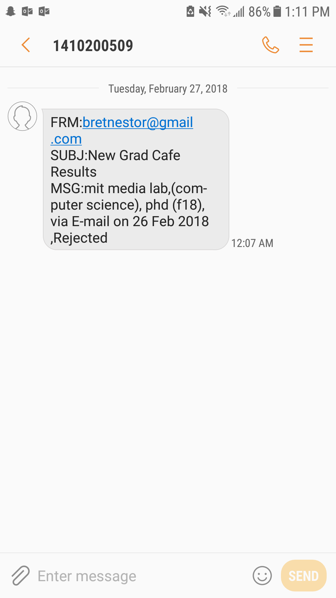

# gradResultScraper
A scraper to send graduate admission results to your phone using python

Results are sampled periodically from http://thegradcafe.com/

## Overview

The goal of this project is to cope with the obsessive behaviour of constantly polling gradcafe for the latest results by having them periodically texted to me. This is achieved in 3 parts:

1.  Scraping results of interest from thegradcafe
2.  Accessing the gmail API to send an sms to my phone
3.  Scheduling this process to happen every once and a while

## Setup
### Google GMAIL API configuration
You must set up a client
follow the instructions in this stackoverflow post to set up the gmail API
<https://stackoverflow.com/questions/37201250/sending-email-via-gmail-python>

The link to the wizard can be found here:
<https://developers.google.com/gmail/api/quickstart/python>

Make sure to drag and drop the client_secret.json file into the root directory of this repository.

in quickstart.py, and in /gradResultScraper/spiders/gradResultScraper.py edit 'phone' and 'email_addr' variables to your own phone number and email address (note:my carrier is in the US so they have a specific extension you must email to convert it into an SMS.Please use the appropriate extension for your provider)

navigate to the parent directory in the terminal

'cd C:/Users/You/Documents/Python/gradResultScraper'

run quickstart.py in a python 3 environment to authenticate the gmail account.

'python quickstart.py'

follow the sign in procedure to allow the program to access your gmail account. I am running this program because the scrapy library gets upset when optional flag arguments are added, which inhibits the program from getting authenticated.

### Selecting the programs of interest
Go ahead and type in search for your program of interest in thegradcafe.com

I copied this url to the 'start_urls' variable in /gradResultScraper/spiders/gradResultScraper.py 'gradResultScraper()' class 

Next I edited 'schools' and 'programs' to be lists containing all of the schools I have applied to and the programs I aplied to. The string can be any substring of the name that correctly identifies the school or program.

### Scheduling the messages
The default frequency of checking is 1 hour. The scraping can be executed by running:

'python scheduledResultsScraper.py'

to change the frequency of the jobs to 3 hours you can alternatively run:

'python scheduledResultsScraper.py 3'

Here is the result:

Hopefully this will program will reduce the number of requests I have to make to thegradcafe servers every day.

Good luck in grad school!

